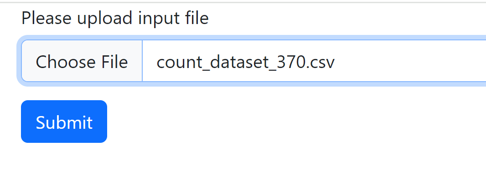
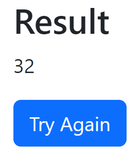

# Introduction
With this application, a sushi restaurant can upload a file containing scans in/out of prepared trays onto a moving belt and receive the net +/- of trays as of the last scan, after error corrections.

# Features
Main features of the application:
- Upload a file through the browser or curl/Postman and view results from the scan processing





Sample file can be found [here](src/test/resources/count_dataset_370.csv)

# Technology Stack
The application is a Web Application, written in Spring Boot with MVC pattern.
For page rendering, thymeleaf is used.

# Deployment

## Local deployment

### Manual

#### System Requirements
- Java 1.8+

#### Deploy
In order to create the executable, run
```bash
>mvn package
```

In order to run the application, run this command from the 
```bash
>java -jar target/sushitrain-X.X.X.jar
```
Application will be reachable at `http://localhost:8080`.


### Development
This is a maven project, and it can be imported it in any Java IDE.

### License
The project is protected under Apache License 2.0